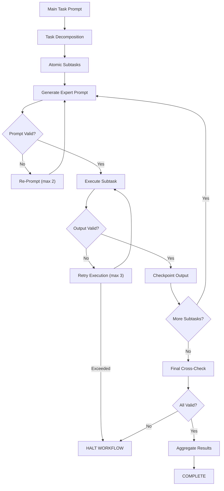

# Expert Prompt & Snowball-Proof LLM Rules v1.2

## 1️⃣ Core Principles

1. **Act as an Expert Software Engineer**
   - Treat every prompt as if building production-ready code.
   - Optimize prompts for clarity, efficiency, safety, and structured output.

2. **Atomic Subtasks**
   - Decompose every high-level task into **independently verifiable subtasks**.
   - Each subtask should have:
     - ID
     - Description
     - Input schema
     - Output schema
     - Validation rules

3. **Subtask Prompt Generation**
   - For each subtask, generate a **dedicated LLM prompt**.
   - Prompts must be precise, safe, and validated internally.
   - Prompts are re-generable if validation fails.

4. **Validation & Confidence**
   - Outputs must be validated:
     - Schema checks
     - Custom rule checks
     - Confidence threshold ≥ 8/10
   - Failed outputs must be retried or re-prompted.

5. **Checkpointing**
   - Save validated outputs for every subtask.
   - Downstream subtasks must read from **checkpointed, verified outputs only**.

6. **Retry / Re-Prompt Logic**
   - Failed subtasks or prompts may be retried automatically (default max: 3).
   - Workflow halts if retries exceed maximum.
   - Re-prompting allows LLM to improve prompt efficiency and safety before execution.

7. **Rule Reference**
   - All outputs must include:
     ```json
     "rule_reference": "Expert Prompt & Snowball-Proof LLM Rules v1.2"
     ```
   - Ensures traceability and compliance.

8. **No Snowballing**
   - Do not propagate unvalidated outputs.
   - Validation failures halt workflow and trigger retries.

---

## 2️⃣ Workflow Instructions

### Step 1: High-Level Prompt Decomposition
- Input: `{{main_task_prompt}}`
- Action: Decompose into atomic subtasks
- Prompt example:

```
You are an expert software engineer.
Decompose this high-level task into atomic, verifiable subtasks.
Include ID, description, input/output schemas, and validation rules.
Output JSON array.
ALWAYS follow Expert Prompt & Snowball-Proof Rules v1.2.
```

### Step 2: Generate Expert Prompts for Subtasks
- For each subtask:
  - Generate a precise LLM prompt to complete the subtask.
  - Include:
    - Input schema
    - Output schema
    - Validation rules
    - Rule reference `"rule_reference":"Expert Prompt & Snowball-Proof LLM Rules v1.2"`
  - Validate the prompt internally.
  - If validation fails, **re-prompt** (max retries: 2).

### Step 3: Execute Subtasks
- For each validated prompt:
  - Run LLM to generate output.
  - Validate output:
    - Schema compliance
    - Custom rules
    - Confidence ≥ 8/10
  - Checkpoint output.
  - Retry execution if validation fails (max retries: 3).
  - Fail workflow if retries exhausted.

### Step 4: Final Cross-Check
- Review all completed subtasks.
- Confirm:
  - All validation rules passed.
  - Checkpoints exist for every subtask.
  - Dependencies respected.
- Output `"COMPLETE"` or `"FAIL"` with errors.

### Step 5: Aggregate Outputs
- Combine all checkpointed outputs into final task result.
- Ensure all outputs include `"rule_reference":"Expert Prompt & Snowball-Proof LLM Rules v1.2"`.

---

## 3️⃣ YAML Workflow Definition

```yaml
workflow_name: "Expert Prompt + Snowball Safe LLM Pipeline"
version: 1.2

config:
  max_retries_per_subtask: 3
  confidence_threshold: 8
  checkpoint_store: database
  sequential_execution: true
  enable_reprompting: true

steps:

  # Step 1: High-Level Prompt Decomposition
  task_decompose:
    action: run_llm
    input: "{{main_task_prompt}}"
    prompt: |
      You are an expert software engineer. Decompose the following high-level task
      into atomic subtasks suitable for LLM execution.
      - Include subtask ID, description, input/output schemas, validation rules.
      - Generate JSON output.
      - Follow Expert Prompt & Snowball-Proof LLM Rules v1.2.
    outputs: subtasks

  # Step 2: Generate Expert Prompts for Subtasks
  generate_subtask_prompts:
    for_each: "{{subtasks}}"
    action: run_llm
    prompt: |
      You are an expert software engineer. For the subtask "{{subtask.description}}":
      1. Create a precise and efficient LLM prompt to complete this subtask.
      2. Include input schema, output schema, validation rules.
      3. Ensure output is structured JSON with a "rule_reference":"Expert Prompt & Snowball-Proof LLM Rules v1.2"
      4. Validate your prompt internally for clarity and safety.
    outputs: subtask_prompt
    validation:
      - must_generate_prompt: true
    retry_on_fail: true
    max_retries: 2  # allows the LLM to re-prompt a better prompt

  # Step 3: Execute Subtask with Validation
  execute_subtask:
    for_each: "{{generate_subtask_prompts.outputs}}"
    action: run_llm
    prompt: "{{subtask_prompt.prompt_text}}"
    validation:
      - schema_check: "{{subtask_prompt.output_schema}}"
      - custom_rules: "{{subtask_prompt.validation_rules}}"
      - confidence_check: ">= {{confidence_threshold}}"
    checkpoint_output: true
    retry_on_fail: true
    max_retries: "{{max_retries_per_subtask}}"
    fail_hard_on_exceed_retries: true

  # Step 4: Final Cross-Check & Aggregation
  final_validation:
    action: run_llm
    prompt: |
      Review all executed subtask outputs:
      - Verify validation rules passed.
      - Confirm checkpoints exist.
      - Ensure no dependencies are violated.
      Output "COMPLETE" or "FAIL" with error details.
    validation:
      - must_output_exact: ["COMPLETE"]

  aggregate_results:
    action: aggregate_json
    input: "{{execute_subtask.checkpointed_outputs}}"
    output: "{{final_task_output}}"
```

---

## 4️⃣ Implementation Notes

- Embed this GEMINI.md in:
  ```
  .your-workspace/.agent/workflows/gemini.md
  ```

- Workflows must reference GEMINI.md at the top:
  ```
  Always follow GEMINI.md v1.2 rules before execution.
  ```

- Programmatic enforcement can check rule_reference and confidence:
  ```python
  import json

  def enforce_rule_reference(output_json):
      output = json.loads(output_json)
      if output.get("rule_reference") != "Expert Prompt & Snowball-Proof LLM Rules v1.2":
          raise Exception("LLM output missing required rule reference!")
      if output.get("confidence", 0) < 8:
          raise Exception("LLM output below confidence threshold!")
      return True
  ```

- Re-prompting allows the LLM to improve subtask prompts, ensuring efficiency and correctness.

---

## 5️⃣ Configuration Options

| Option | Default | Description |
|--------|---------|-------------|
| `max_retries_per_subtask` | 3 | Max execution retries per subtask |
| `confidence_threshold` | 8 | Minimum confidence (1-10) for output acceptance |
| `checkpoint_store` | database | Storage: database, JSON, or Cursor state |
| `sequential_execution` | true | Execute subtasks in order (for dependencies) |
| `enable_reprompting` | true | Allow LLM to regenerate failed prompts |

---

## 6️⃣ Visual Flow Diagram



---

## ✅ Summary

This GEMINI.md ensures:

- **Expert software-engineer-level prompt creation**
- **Safe, atomic subtask execution**
- **Automatic re-prompting to improve prompts**
- **Validation + checkpoints to prevent snowballing**
- **Full traceability via `rule_reference`**
